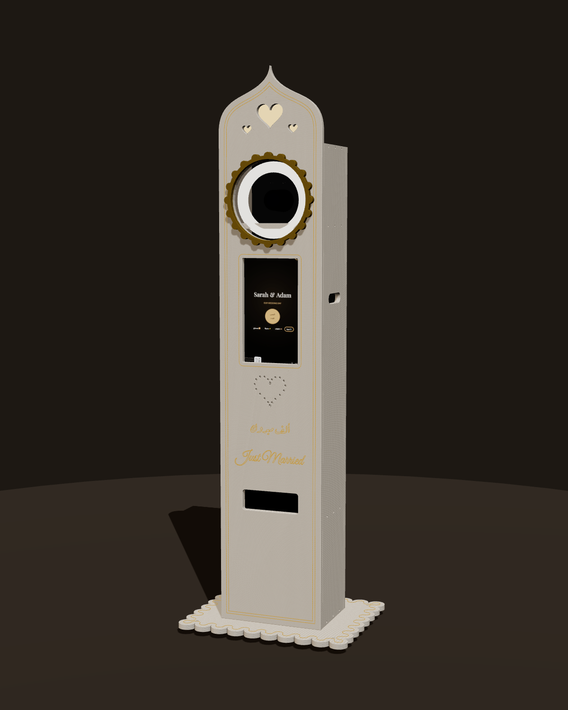
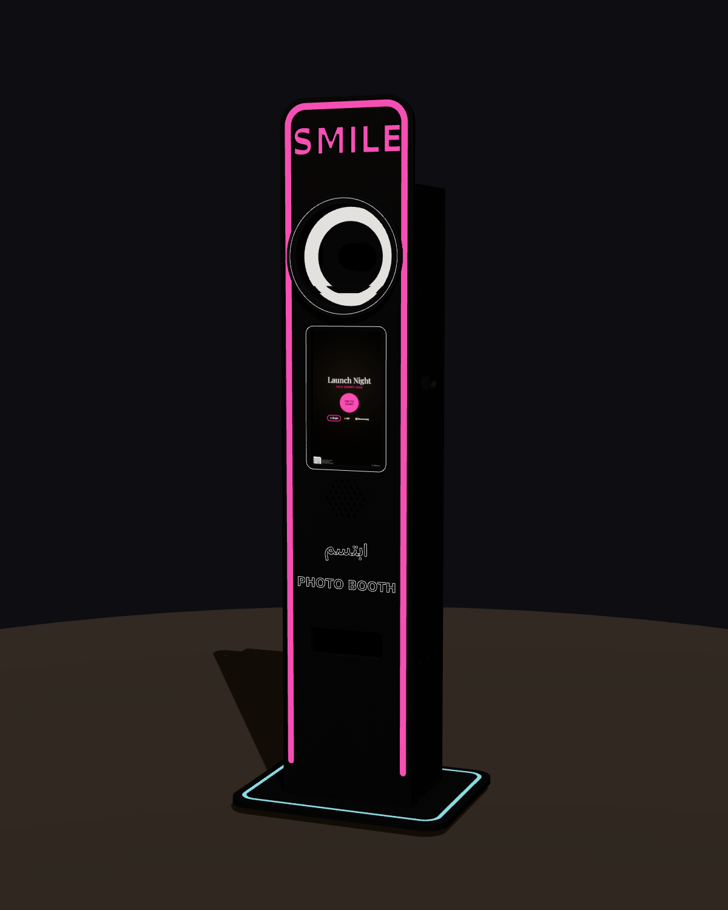

# 📐 Photobooth totem — CNC cut from ONE MDF sheet

Two photobooth enclosure designs. Each one is cut completely from **one standard MDF sheet as sold in Egypt (122 × 244 cm, 18 mm)** on a CNC router with a 6 mm bit.

| 💍 Wedding — Moorish arch | 🎉 Events — Neon |
|---|---|
|  |  |
| Ogee arch crest, backlit heart cut-outs, gold engraved double border, heart speaker grille, scalloped camera rosette, engraved **"ألف مبروك"** and **"Just Married"**, scalloped base | "SMILE" letters cut through and backlit, 17 mm LED channels around the whole front, hexagon speaker grille, engraved **"ابتسم"** and **"PHOTO BOOTH"**, glowing base edge |

## What to send to the CNC workshop

| File | What it is |
|---|---|
| `wedding/photobooth-wedding-mdf18mm.dxf` | Cut file for the wedding design: the whole sheet, 1:1 in mm |
| `events/photobooth-events-mdf18mm.dxf` | Cut file for the events design |
| `photobooth-cnc-guide.pdf` | A3 guide: renders, cutting layouts, dimensioned drawings, parts list, hardware list and an **Arabic page for the CNC operator** |
| `photobooth-3d-viewer.html` | Interactive 3D model with both designs and an exploded view. Open it in any browser; it works offline. |
| `*/sheet-layout.svg` / `.png`, `*/front-drawing.png` | Previews |

**DXF layers:** every operation has its own layer and colour.

| Layer | Operation |
|---|---|
| `ENGRAVE_V` | V-bit engraving, 3 mm deep (decoration and text) |
| `POCKET_8` | 8 mm deep pocket for LED channels (events design) |
| `DRILL_7` | 7 mm through (confirmat screws) |
| `DRILL_10` | 10 mm through (M8 T-nuts, bolts, levelling feet) |
| `CUT_INSIDE` | Through cut, inside the line (windows, holes, hearts, letters) |
| `CUT_DOOR` | Through cut **on** the line. The loose piece becomes the service door. |
| `CUT_OUTSIDE` | Through cut, outside the line, with tabs. Do this last. |
| `SHEET`, `LABELS` | Reference only. Don't cut. |

Suggested settings for 18 mm MDF:
- **Bit:** 6 mm 2-flute compression or upcut.
- **Speeds:** 18 000 rpm, feed 2500–3500 mm/min, plunge 800 mm/min.
- **Passes:** 3 (6 mm each).
- **Tabs:** 8 × 3 mm, about every 30 cm.

## Design

- **Size:** a 360 × 260 mm tower, 1.60 m body plus a crest or sign, about **1.85 m** tall on a 600 × 480 mm base. That's slim enough that all four full-height walls fit across the 122 cm sheet.
- **Front openings:**
  - Ø262 mm window for a **10″ ring light**, with the camera looking through its centre at 1.42 m
  - 196 × 346 mm window for a **15.6″ portable touch monitor in portrait**
  - 200 × 70 mm print slot for a **Canon SELPHY**
  - speaker grille
- **Inside:** floor, printer shelf, camera shelf (with a ¼″ tripod-screw slot) and top plate.
- **Back:** two **service doors**, made from the pieces cut out of the back panel so they cost no extra material. Plus vents.
- **Sides:** carry handles on both, and a cable exit on one.
- **No visible screws on the front:** it's fixed from inside with L-brackets. Everything else uses confirmat screws.
- **Knock-down base:** the tower bolts to the base with M8 bolts and T-nuts, and the base has levelling feet. Add 10 kg of ballast in the bottom compartment.
- **Light box:** the crest hearts and "SMILE" letters need a frosted 3 mm acrylic sheet and an LED strip behind them.

The hardware, electronics and assembly steps are in the PDF.

## Make it yours

Everything is generated by `generate.py`, and all the measurements are at the top of the file.
- **Different monitor, ring light or printer:** change `SCREEN`, `RING`, `PRINT_SLOT` and `MONITOR`.
- **16 mm MDF:** set `T = 16`.
- **Couple's names in the engraving:** edit the texts in `front_wedding()`, e.g. `'Sarah & Adam'`. Arabic works too; it's shaped with HarfBuzz.

The generator checks that every part stays on the sheet and at least 10 mm from its neighbours before writing the DXF.

```bash
pip install ezdxf shapely fonttools brotli uharfbuzz matplotlib
python3 hardware/generate.py        # DXF + parts.json (checks the nesting)
python3 hardware/drawings.py        # sheet layouts, drawings, PDF guide
npm install three@0.160.0 && python3 hardware/build_viewer.py   # 3D viewer
```

---

## بالعربي — ملخص للورشة

- **الخامة:** لوح MDF واحد مقاس 122 × 244 سم، سُمك 18 مم لكل تصميم.
- **البنطة:** 6 مم فلات.
- **الملفات:** ملف DXF بالمليمتر بمقياس 1:1، وكل عملية على طبقة مستقلة.
- **ترتيب العمليات:**
  1. الحفر `ENGRAVE_V`
  2. الجيوب `POCKET_8`
  3. التخريم `DRILL_7` و `DRILL_10`
  4. القص الداخلي `CUT_INSIDE`
  5. الأبواب `CUT_DOOR`، على الخط، والقطعة الخارجة هي الباب
  6. القص الخارجي `CUT_OUTSIDE` في النهاية مع تابات
- **قبل القص:** تأكد من مقاس الشاشة (15.6 بوصة رأسية) والرينج لايت (10 بوصة). لو مختلفة، عدّل المقاسات في أول ملف `generate.py`.
- **التفاصيل:** كل التفاصيل وقائمة الخامات بالعربي موجودة في آخر صفحة من ملف `photobooth-cnc-guide.pdf`.
